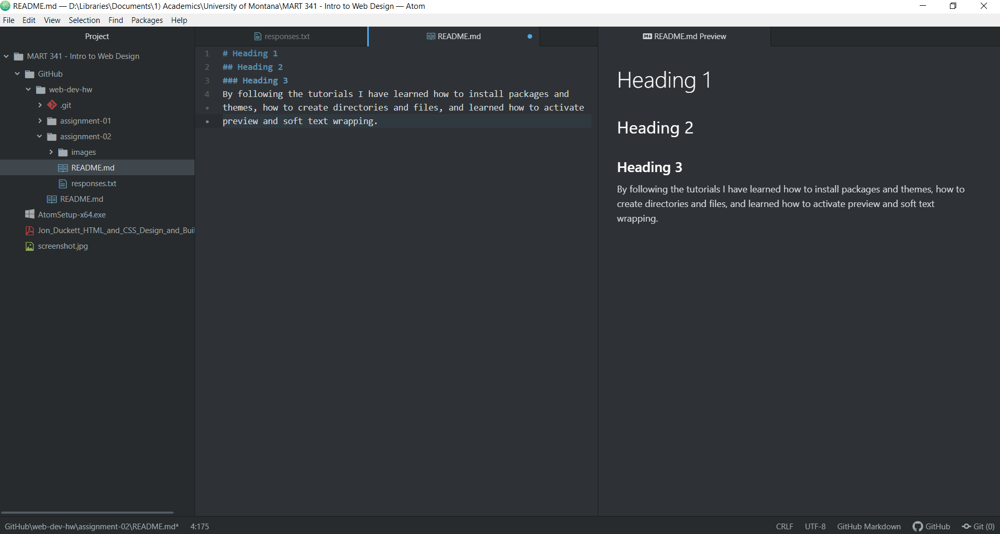

# Assignment 2
## Scott Kinyon

I chose to take this Web Development and Design class since it is a requirement for my degree in Media Arts.  However, I am also excited to learn more about the content for its own sake.  I recognize that coding is an invaluable skill in today's world and the world wide web is increasingly dominating the human experience by revolutionizing communication, knowledge exchange, and cultural expression.  Politics, economics, and personal relationships are enacted, influenced, and manifested online.  Learning the languages of this online world will allow us to wield greater influence in countless arenas.

I have already learned some of the fundamental best practices and philosophies of coding including:
+ Organization of files
+ Collaboration with other users
+ The importance of version control

I hope to dive into some coding languages, to learn more best practices of coding, and to build a foundation for further personal development in web design and coding.

Below are the required links for this week's assignment:

[Roll20 Tabletop Gaming Simulator](https://roll20.net)

[My Responses](./responses.txt)

