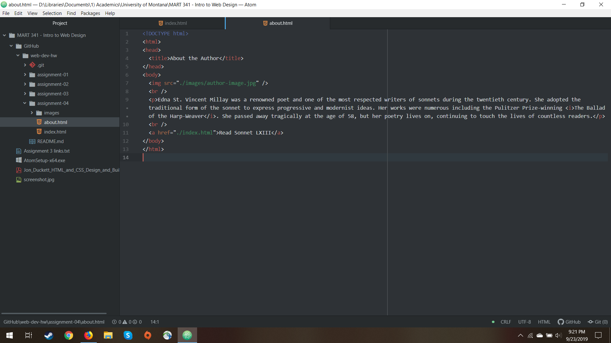

# Assignment 4
## Scott Kinyon

My journey through the Wayback Machine took me to behance.com in February of 2008. Now behance.com redirects to the new home behance.net.  The differences don't end there however. Behance now has larger images dominating its homepage with less text.  This seems to track with more recent minimalist design philosophy. Furthermore, since the site showcases art, the archive from 2008 shows that even art from a decade ago is starting to show its age.  That which once was groundbreaking is now the mainstream.

Using the GitHub Desktop gives me more efficiency and control over what I upload to GitHub and allows me to do more work natively without needing to constantly sign into the GitHub website. I like working with it thus far.

