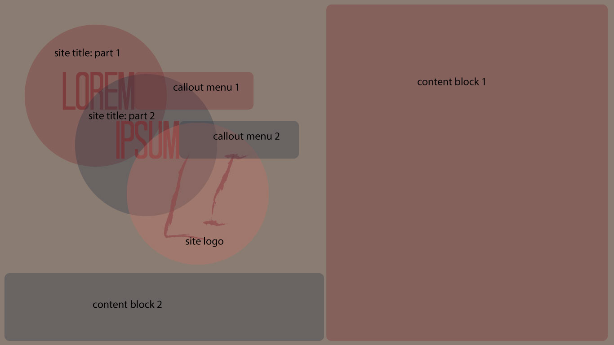

# Scott Kinyon
## Assignment 11

Padding, margin, and borders are tools in CSS that can help divide and space out one group of content from other groups. Padding adds extra space inside of an element. Margins add extra space outside of an element. Borders add a delineation around the edge of an element.

See below the sketch for my site (I used Adobe Illustrator for this sketch):

For this assignment I perused some designs on Awwwards and found a circle dominated design that I really liked. I then worked out the above sketch in Illustrator and built out my HTML and CSS files to try to capture the look and feel of my sketch. I included the fonts I used in Illustrator and the .png file of the logo I made in Illustrator. There was a lot of trial-and-error to get the page layout to match the original sketch. The final product is close to what I want, but ideally I would make the layout more adaptive for mobile devices, etc.
